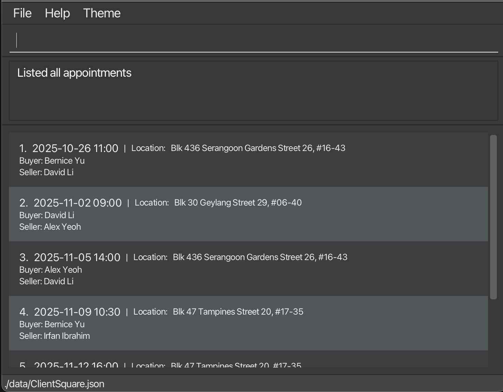

**ClientSquare** provides a fast and convenient way for property agents to track buyers, sellers, property listings of clients and viewing schedules.

* It is **written in OOP fashion**. It provides a **reasonably well-written** code base **bigger** (around 6 KLoC) than what students usually write in beginner-level SE modules, without being overwhelmingly big.
* It comes with a **reasonable level of user and developer documentation**.
* For the detailed documentation of this project, see the **[ClientSquare Product Website](https://ay2526s1-cs2103t-f08a-3.github.io/tp/)**.

