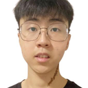
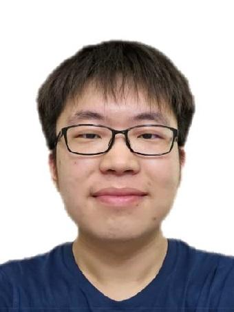
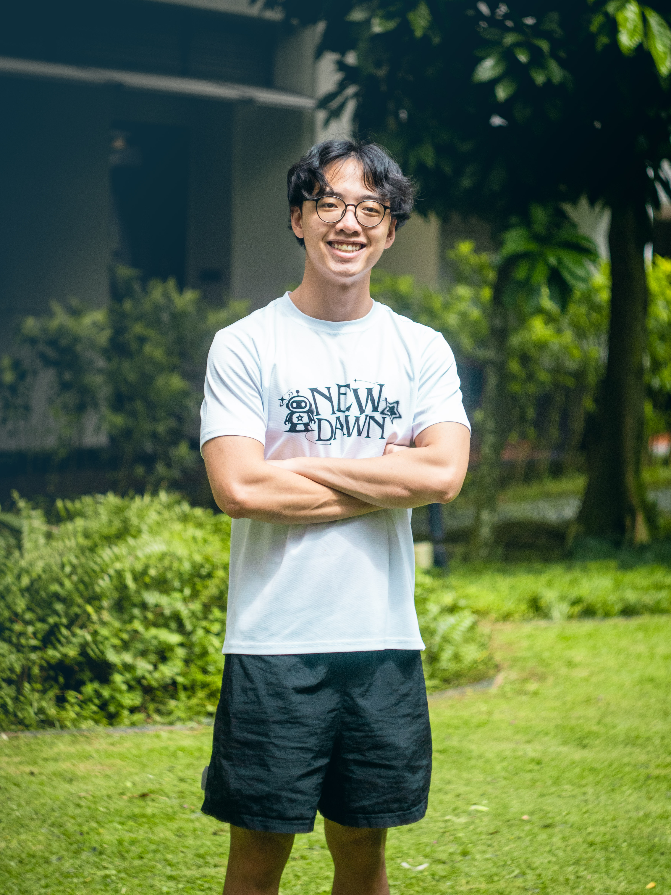

We are a team based in the [School of Computing, National University of Singapore](https://www.comp.nus.edu.sg).

You can reach us at the email `seer[at]comp.nus.edu.sg`

## Project team

### Balakrishnan Naveen Mani Kumar

[[github](https://github.com/balkinaveen)]
[[portfolio](team/naveen.md)]

* Role: Ideator, Developer
* Responsibilities: Integration & Merges, Feature design

### Jake Kee

[[github](http://github.com/jakekeech)]
[[portfolio](team/jakekeech.md)]

* Role: Team Lead
* Responsibilities: UI

### Jordan

[[github](http://github.com/ngjsjordan)] [[portfolio](team/ngjsjordan.md)]

* Role: Developer
* Responsibilities: Code Quality, In charge of Model

### Jeric Tan

[[github](http://github.com/jeric-tan)]
[[portfolio](team/jeric-tan.md)]

* Role: Developer
* Responsibilities: Documentation

### Gabriel Er

[[github](https://github.com/gab-er)]
[[portfolio](team/gab-er.md)]

* Role: Developer
* Responsibilities: Storage
