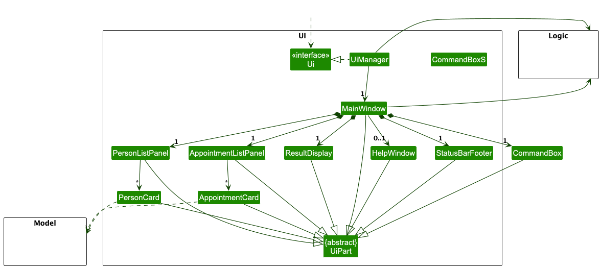
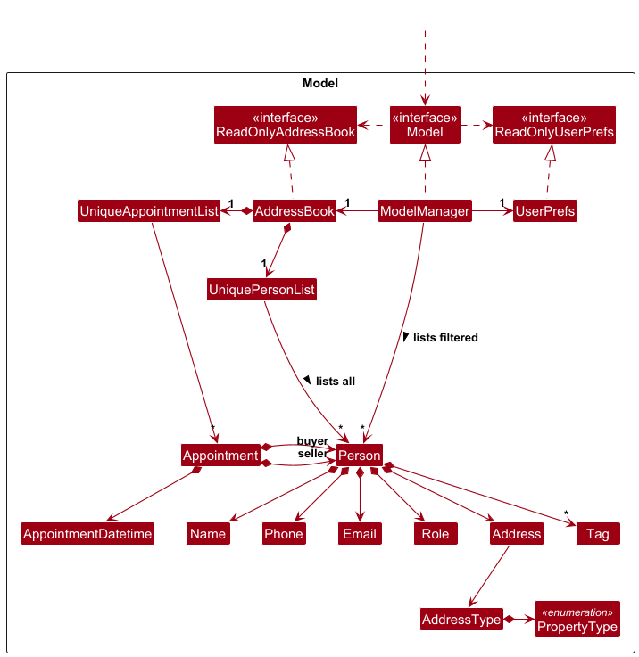

* Table of Contents
{:toc}

--------------------------------------------------------------------------------------------------------------------

## **Acknowledgements**

* {list here sources of all reused/adapted ideas, code, documentation, and third-party libraries -- include links to the original source as well}

--------------------------------------------------------------------------------------------------------------------

## **Setting up, getting started**

Refer to the guide [_Setting up and getting started_](SettingUp.md).

--------------------------------------------------------------------------------------------------------------------

## **Design**

:bulb: **Tip:** The `.puml` files used to create diagrams are in this document `docs/diagrams` folder. Refer to the [_PlantUML Tutorial_ at se-edu/guides](https://se-education.org/guides/tutorials/plantUml.html) to learn how to create and edit diagrams.

### Architecture

The ***Architecture Diagram*** given above explains the high-level design of the App.

Given below is a quick overview of main components and how they interact with each other.

**Main components of the architecture**

**`Main`** (consisting of classes [`Main`](https://github.com/se-edu/addressbook-level3/tree/master/src/main/java/seedu/address/Main.java) and [`MainApp`](https://github.com/se-edu/addressbook-level3/tree/master/src/main/java/seedu/address/MainApp.java)) is in charge of the app launch and shut down.
* At app launch, it initializes the other components in the correct sequence, and connects them up with each other.
* At shut down, it shuts down the other components and invokes cleanup methods where necessary.

The bulk of the app's work is done by the following four components:

* [**`UI`**](#ui-component): The UI of the App.
* [**`Logic`**](#logic-component): The command executor.
* [**`Model`**](#model-component): Holds the data of the App in memory.
* [**`Storage`**](#storage-component): Reads data from, and writes data to, the hard disk.

[**`Commons`**](#common-classes) represents a collection of classes used by multiple other components.

**How the architecture components interact with each other**

The *Sequence Diagram* below shows how the components interact with each other for the scenario where the user issues the command `delete 1` in order to delete the first person in the displayed list.

Each of the four main components (also shown in the diagram above),

* defines its *API* in an `interface` with the same name as the Component.
* implements its functionality using a concrete `{Component Name}Manager` class (which follows the corresponding API `interface` mentioned in the previous point.

For example, the `Logic` component defines its API in the `Logic.java` interface and implements its functionality using the `LogicManager.java` class which follows the `Logic` interface. Other components interact with a given component through its interface rather than the concrete class (reason: to prevent outside component's being coupled to the implementation of a component), as illustrated in the (partial) class diagram below.

The sections below give more details of each component.

### UI component

The **API** of this component is specified in [`Ui.java`](https://github.com/se-edu/addressbook-level3/tree/master/src/main/java/seedu/address/ui/Ui.java)

The UI consists of a `MainWindow` that is made up of parts e.g.`CommandBox`, `ResultDisplay`, `PersonListPanel`, `StatusBarFooter` etc. All these, including the `MainWindow`, inherit from the abstract `UiPart` class which captures the commonalities between classes that represent parts of the visible GUI.

The `UI` component uses the JavaFx UI framework. The layout of these UI parts are defined in matching `.fxml` files that are in the `src/main/resources/view` folder. For example, the layout of the [`MainWindow`](https://github.com/se-edu/addressbook-level3/tree/master/src/main/java/seedu/address/ui/MainWindow.java) is specified in [`MainWindow.fxml`](https://github.com/se-edu/addressbook-level3/tree/master/src/main/resources/view/MainWindow.fxml)

The `UI` component,

* executes user commands using the `Logic` component.
* listens for changes to `Model` data so that the UI can be updated with the modified data.
* keeps a reference to the `Logic` component, because the `UI` relies on the `Logic` to execute commands.
* depends on some classes in the `Model` component, as it displays `Person` object residing in the `Model`.

### Logic component

**API** : [`Logic.java`](https://github.com/se-edu/addressbook-level3/tree/master/src/main/java/seedu/address/logic/Logic.java)

Here's a (partial) class diagram of the `Logic` component:

The sequence diagram below illustrates the interactions within the `Logic` component, taking `execute("delete 1")` API call as an example.

:information_source: **Note:** The lifeline for `DeleteCommandParser` should end at the destroy marker (X) but due to a limitation of PlantUML, the lifeline continues till the end of diagram.

How the `Logic` component works:

1. When `Logic` is called upon to execute a command, it is passed to an `AddressBookParser` object which in turn creates a parser that matches the command (e.g., `DeleteCommandParser`) and uses it to parse the command.
1. This results in a `Command` object (more precisely, an object of one of its subclasses e.g., `DeleteCommand`) which is executed by the `LogicManager`.
1. The command can communicate with the `Model` when it is executed (e.g. to delete a person). 
   Note that although this is shown as a single step in the diagram above (for simplicity), in the code it can take several interactions (between the command object and the `Model`) to achieve.
1. The result of the command execution is encapsulated as a `CommandResult` object which is returned back from `Logic`.

Here are the other classes in `Logic` (omitted from the class diagram above) that are used for parsing a user command:

How the parsing works:
* When called upon to parse a user command, the `AddressBookParser` class creates an `XYZCommandParser` (`XYZ` is a placeholder for the specific command name e.g., `AddCommandParser`) which uses the other classes shown above to parse the user command and create a `XYZCommand` object (e.g., `AddCommand`) which the `AddressBookParser` returns back as a `Command` object.
* All `XYZCommandParser` classes (e.g., `AddCommandParser`, `DeleteCommandParser`, ...) inherit from the `Parser` interface so that they can be treated similarly where possible e.g, during testing.

### Model component
**API** : [`Model.java`](https://github.com/se-edu/addressbook-level3/tree/master/src/main/java/seedu/address/model/Model.java)

The `Model` component,

* stores the address book data i.e., all `Person` objects (which are contained in a `UniquePersonList` object).
* stores the currently 'selected' `Person` objects (e.g., results of a search query) as a separate _filtered_ list which is exposed to outsiders as an unmodifiable `ObservableList<Person>` that can be 'observed' e.g. the UI can be bound to this list so that the UI automatically updates when the data in the list change.
* stores a `UserPref` object that represents the user’s preferences. This is exposed to the outside as a `ReadOnlyUserPref` objects.
* does not depend on any of the other three components (as the `Model` represents data entities of the domain, they should make sense on their own without depending on other components)

:information_source: **Note:** An alternative (arguably, a more OOP) model is given below. It has a `Tag` list in the `AddressBook`, which `Person` references. This allows `AddressBook` to only require one `Tag` object per unique tag, instead of each `Person` needing their own `Tag` objects. 

### Storage component

**API** : [`Storage.java`](https://github.com/se-edu/addressbook-level3/tree/master/src/main/java/seedu/address/storage/Storage.java)

The `Storage` component,
* can save both address book data and user preference data in JSON format, and read them back into corresponding objects.
* inherits from both `AddressBookStorage` and `UserPrefStorage`, which means it can be treated as either one (if only the functionality of only one is needed).
* depends on some classes in the `Model` component (because the `Storage` component's job is to save/retrieve objects that belong to the `Model`)

### Common classes

Classes used by multiple components are in the `seedu.address.commons` package.

--------------------------------------------------------------------------------------------------------------------

## **Implementation**

This section describes some noteworthy details on how certain features are implemented.

### \[Proposed\] Undo/redo feature

#### Proposed Implementation

The proposed undo/redo mechanism is facilitated by `VersionedAddressBook`. It extends `AddressBook` with an undo/redo history, stored internally as an `addressBookStateList` and `currentStatePointer`. Additionally, it implements the following operations:

* `VersionedAddressBook#commit()` — Saves the current address book state in its history.
* `VersionedAddressBook#undo()` — Restores the previous address book state from its history.
* `VersionedAddressBook#redo()` — Restores a previously undone address book state from its history.

These operations are exposed in the `Model` interface as `Model#commitAddressBook()`, `Model#undoAddressBook()` and `Model#redoAddressBook()` respectively.

Given below is an example usage scenario and how the undo/redo mechanism behaves at each step.

Step 1. The user launches the application for the first time. The `VersionedAddressBook` will be initialized with the initial address book state, and the `currentStatePointer` pointing to that single address book state.

Step 2. The user executes `delete 5` command to delete the 5th person in the address book. The `delete` command calls `Model#commitAddressBook()`, causing the modified state of the address book after the `delete 5` command executes to be saved in the `addressBookStateList`, and the `currentStatePointer` is shifted to the newly inserted address book state.

Step 3. The user executes `add n/David …​` to add a new person. The `add` command also calls `Model#commitAddressBook()`, causing another modified address book state to be saved into the `addressBookStateList`.

:information_source: **Note:** If a command fails its execution, it will not call `Model#commitAddressBook()`, so the address book state will not be saved into the `addressBookStateList`.

Step 4. The user now decides that adding the person was a mistake, and decides to undo that action by executing the `undo` command. The `undo` command will call `Model#undoAddressBook()`, which will shift the `currentStatePointer` once to the left, pointing it to the previous address book state, and restores the address book to that state.

:information_source: **Note:** If the `currentStatePointer` is at index 0, pointing to the initial AddressBook state, then there are no previous AddressBook states to restore. The `undo` command uses `Model#canUndoAddressBook()` to check if this is the case. If so, it will return an error to the user rather
than attempting to perform the undo.

The following sequence diagram shows how an undo operation goes through the `Logic` component:

:information_source: **Note:** The lifeline for `UndoCommand` should end at the destroy marker (X) but due to a limitation of PlantUML, the lifeline reaches the end of diagram.

Similarly, how an undo operation goes through the `Model` component is shown below:

The `redo` command does the opposite — it calls `Model#redoAddressBook()`, which shifts the `currentStatePointer` once to the right, pointing to the previously undone state, and restores the address book to that state.

:information_source: **Note:** If the `currentStatePointer` is at index `addressBookStateList.size() - 1`, pointing to the latest address book state, then there are no undone AddressBook states to restore. The `redo` command uses `Model#canRedoAddressBook()` to check if this is the case. If so, it will return an error to the user rather than attempting to perform the redo.

Step 5. The user then decides to execute the command `list`. Commands that do not modify the address book, such as `list`, will usually not call `Model#commitAddressBook()`, `Model#undoAddressBook()` or `Model#redoAddressBook()`. Thus, the `addressBookStateList` remains unchanged.

Step 6. The user executes `clear`, which calls `Model#commitAddressBook()`. Since the `currentStatePointer` is not pointing at the end of the `addressBookStateList`, all address book states after the `currentStatePointer` will be purged. Reason: It no longer makes sense to redo the `add n/David …​` command. This is the behavior that most modern desktop applications follow.

The following activity diagram summarizes what happens when a user executes a new command:

#### Design considerations:

**Aspect: How undo & redo executes:**

* **Alternative 1 (current choice):** Saves the entire address book.
  * Pros: Easy to implement.
  * Cons: May have performance issues in terms of memory usage.

* **Alternative 2:** Individual command knows how to undo/redo by
  itself.
  * Pros: Will use less memory (e.g. for `delete`, just save the person being deleted).
  * Cons: We must ensure that the implementation of each individual command are correct.

_{more aspects and alternatives to be added}_

--------------------------------------------------------------------------------------------------------------------

## **Documentation, logging, testing, configuration, dev-ops**

* [Documentation guide](Documentation.md)
* [Testing guide](Testing.md)
* [Logging guide](Logging.md)
* [Configuration guide](Configuration.md)
* [DevOps guide](DevOps.md)

--------------------------------------------------------------------------------------------------------------------

## **Appendix: Requirements**

### Product scope

**Target user profile**:

* freelance property agents
* interacts regularly with many clients looking to buy/sell properties
* prefer desktop apps over other types
* can type fast
* prefers typing to mouse interactions
* is reasonably comfortable using CLI apps

**Value proposition**: provide a fast and convenient way to track buyers, sellers, property listings of clients and viewing schedules.

### User stories

Priorities: High (must have) - `* * *`, Medium (nice to have) - `* *`, Low (unlikely to have) - `*`

| Priority | As a …​                                     | I want to …​                    | So that I can…​                                                        |
|----------| ------------------------------------------ | ------------------------------ | ---------------------------------------------------------------------- |
| `* * *`  | new user                                   | see usage instructions         | refer to instructions when I forget how to use the App                 |
| `* * *`  | user                                       | add a new buyer/seller         | remember client details                                                |
| `* * *`  | user                                       | tag sellers' property details  | easily note and view an important piece of information                 |
| `* * *`  | user                                       | delete a client                | remove entries that I no longer need                                   |
| `* * *`  | user                                       | list clients                   | get an overview of clients and properties                              |
| `* * *`  | user                                       | find a client by name          | locate details of a client without having to go through the entire list|
| `* * *`  | user                                       | find a property by name        | locate property and seller details without going through the list      |
| `* * *`  | user                                       | schedule appointments          | manage my time effectively                                             |
| `* * *`  | user                                       | view upcoming appointments     | keep track of client meetings                                          |
| `* *`    | new user                                   | import contacts from my phone  | get set up quickly                                                     |
| `* *`    | user                                       | edit client information        | update details when they change                                        |
| `* *`    | user                                       | filter properties              | find properties to recommend to buyers                                 |
| `*`      | user                                       | track transaction progress     | keep track of deals involving buyers/sellers                           |
| `*`      | user with many persons in the address book | sort persons by name           | locate a person easily                                                 |
| `*`      | user with many persons in the address book | find a person with similar name| find the client I'm looking for amidst many similar names              |
| `*`      | user who is a co-broking agent             | add partner agents             | keep track of others involved in a deal                                |
| `*`      | user with vision impairments               | use accessibility options      | use the application without eye strain                                 |
| `*`      | user                                       | store property images          | easily show it to potential buyers                                     |
| `*`      | user                                       | gather data about transactions | adapt my work to strike better deals                                   |

*{More to be added}*

### Use cases

(For all use cases below, the **System** is `ClientSquare` and the **Actor** is the `user`, unless specified otherwise)

**Use case: UC01 - Add a buyer/seller**

**MSS**

1.  User requests to add a buyer or seller
2.  ClientSquare adds the buyer or seller

    Use case ends.

**Extensions**

* 1a. Some required information is missing or invalid.

  * 1a1. ClientSquare shows an error message. 

    Step 1 is repeated until the input is valid.
    Use case resumes from step 2.

**Use case: UC02 - View clients**

**MSS**

1.  User requests to list clients
2.  ClientSquare shows a list of clients

    Use case ends.

**Use case: UC03 -  Remove a buyer/seller**

**MSS**

1.  User requests to list clients
2.  ClientSquare shows a list of clients
3.  User requests to delete a specific client in the list
4.  ClientSquare deletes the person

    Use case ends.

**Extensions**

* 2a. The list is empty.

  Use case ends.

* 3a. The given index is invalid.

    * 3a1. ClientSquare shows an error message.

      Use case resumes at step 2.

**Use case: UC04 - Searching contacts**

**MSS**

1.  User requests to find contacts/properties by keyword(s)
2.  ClientSquare shows a list of matching contacts/properties

    Use case ends.

**Extensions**

* 1a. Keyword is missing.

  * 1a1. ClientSquare shows an error message. 

    Step 1 is repeated until the input is valid.
    Use case resumes from step 2.

**Use case: UC05 - Add an appointment**

**MSS**

1.  User finds the clients involved (UC04)
2.  User requests to add an appointment
3.  ClientSquare adds the appointment

    Use case ends.

**Extensions**

* 2a. Some required information is missing or invalid.

  * 2a1. ClientSquare shows an error message. 

    Step 2 is repeated until the input is valid.
    Use case resumes from step 3.

**Use case: UC06 - View appointments**

**MSS**

1.  User requests to list appointments
2.  ClientSquare shows a list of appointments

    Use case ends.

**Use case: UC07 - Remove an appointment**

**MSS**

1.  User requests to list appointments
2.  ClientSquare shows a list of appointments
3.  User requests to delete a specific appointment in the list
4.  ClientSquare deletes the appointment

    Use case ends.

**Extensions**

* 2a. The list is empty.

  Use case ends.

* 3a. The given index is invalid.

    * 3a1. ClientSquare shows an error message.

      Use case resumes at step 2.

**Use case: UC08 - Edit an appointment**

**MSS**

1.  User requests to list appointments (UC06)
2.  User requests to edit a specific appointment in the list.
3.  ClientSquare edits the appointment

    Use case ends.

**Extensions**

* 1a. User is unable to find the desired appointment

    * 1a1. User searches for the desired appointment (UC09)    
    
      Use case resumes from step 2.

* 1b. There are no appointments in the list.
  
  Use case ends.

* 2a. The requested edits are invalid.
  
    * 2a1. ClientSquare shows an error message.

      Step 2 is repeated until the input is valid.
      Use case resumes from step 3.

**Use case: UC09 - Search for appointment**

**MSS**

1.  User requests to find appointments by keyword(s) and/or timeframe
2.  ClientSquare shows a list of matching appointments

    Use case ends.

**Extensions**

* 1a. Both keyword and timeframe are missing.

    * 1a1. ClientSquare shows an error message.

      Step 1 is repeated until the input is valid.
      Use case resumes from step 2.

* 1b. Invalid timeframe is provided.

    * 1b1. ClientSquare shows an error message.

      Step 1 is repeated until the input is valid.
      Use case resumes from step 2.

### Non-Functional Requirements

1.  Should work on any _mainstream OS_ as long as it has Java `17` or above installed.
2.  Should be able to hold up to 1000 persons without a noticeable sluggishness in performance for typical usage.
3.  A user with above average typing speed for regular English text (i.e. not code, not system admin commands) should be able to accomplish most of the tasks faster using commands than using the mouse.
4.  The product is to be used by a single user. 
5.  The product should work without requiring an installer.
6.  The product should work without any other external / online services. 
5.  The product should not exceed 100MB in size.

*{More to be added}*

### Glossary

* **Client**: A buyer or seller listed as a contact, or is intended to be listed as a contact
* **Mainstream OS**: Windows, Linux, Unix, MacOS

--------------------------------------------------------------------------------------------------------------------

## **Appendix: Instructions for manual testing**

Given below are instructions to test the app manually.

:information_source: **Note:** These instructions only provide a starting point for testers to work on;
testers are expected to do more *exploratory* testing.

### Launch and shutdown

1. Initial launch

   1. Download the jar file and copy into an empty folder

   1. Double-click the jar file  
      Expected: Shows the GUI with a set of sample contacts. The window size may not be optimum.

1. Saving window preferences

   1. Resize the window to an optimum size. Move the window to a different location. Close the window.

   1. Re-launch the app by double-clicking the jar file. 
       Expected: The most recent window size and location is retained.

1. Launching with existing data

   1. Prerequisites: Have previously launched the app and added/modified some data. The `data/ClientSquare.json` file exists with your custom data.

   1. Double-click the jar file. 
      Expected: The application starts with your previously saved data (persons and appointments). No sample data is loaded.

1. Shutting down the application

   1. Test case: Close using the window's close button (X)  
      Expected: The application closes gracefully. All data is saved to `data/ClientSquare.json`. Window preferences are saved.

   1. Test case: Use the `exit` command in the command box  
      Expected: The application closes gracefully. All data is saved to `data/ClientSquare.json`. Window preferences are saved.

   1. Test case: Use `File > Exit` menu option  
      Expected: The application closes gracefully. All data is saved to `data/ClientSquare.json`. Window preferences are saved.

### Adding an appointment

1. Adding an appointment while all persons are shown. To verify that an appointment has been added, use the `lap` command to show all appointments.

   1. Prerequisites: List all persons using the `list` command. Multiple persons should be in the list. The following test cases will use the sample data. If the sample data has been cleared/modified, simply delete the json file to regenerate it.

   1. Test case: `ap d/2025-01-01T00:00 s/4 b/3`  
      Expected: A new appointment is added at datetime 2025-01-01T00:00, with seller being the person at index 4, and buyer the person at index 3. 

   1. Test case: `ap d/2025-01-01T00:00 s/5`  
      Expected: A new appointment is added at datetime 2025-01-01T00:00, with seller being the person at index 5, and no buyer. 

   1. Test case: `ap d/2025-01-01T00:00 b/3`  
      Expected: An error will be shown as it is not possible to add appointments without a seller.

   1. Test case: `ap d/2025-01-01T00:00 s/3`  
      Expected: An error will be shown as the referenced seller does not have the seller role.
   
   1. Test case: `ap d/2025-01-01T00:00 s/4 b/5`  
      Expected: An error will be shown as the referenced buyer does not have the buyer role.

### Searching for an appointment

1. Searching for appointments using keywords and/or timeframes.

   1. Prerequisites: Have some appointments in the appointment list. Use the `lap` command to view all appointments. The following test cases will use the sample data. If the sample data has been cleared/modified, simply delete the `data/ClientSquare.json` file to regenerate it.

   1. Test case: `sap Bernice`  
      Expected: 2 appointment(s) listed!, with 2 appointments showing up in the UI.

   1. Test case: `sap tf/upcoming`  
      Expected: 4 appointment(s) listed!, with 4 appointments showing up in the UI.

   1. Test case: `sap tf/past Bernice`  
      Expected: 1 appointment(s) listed!, with 1 appointment showing up in the UI.

   1. Test case: `sap`  
      Expected: No appointments are listed. An error message is shown indicating the invalid command format and shows the correct usage.

   1. Test case: `sap tf/invalid`  
      Expected: Timeframe should be one of: past, today, upcoming (case-insensitive)

### Deleting an appointment

1. Deleting an appointment while appointments are being shown.

   1. Prerequisites: Have some appointments in the appointment list. Use the `lap` command to view all appointments. The following test cases will use the sample data. If the sample data has been cleared/modified, simply delete the `data/ClientSquare.json` file to regenerate it.

   1. Test case: `dap 1`  
      Expected: The first appointment in the displayed list is deleted. Details of the deleted appointment are shown in the result message, including the appointment datetime and seller name. The appointment is removed from the appointment list.

   1. Test case: `dap 100` (considering user have less than 100 appointments)   
      Expected: No appointment is deleted. An error message is shown indicating that the appointment index provided is invalid.

   1. Test case: `dap 0`  
      Expected: No appointment is deleted. An error message is shown indicating the invalid command format and shows the correct usage.

   1. Test case: `dap`  
      Expected: No appointment is deleted. An error message is shown indicating the invalid command format and shows the correct usage.

1. Deleting an appointment after filtering

   1. Prerequisites: Filter the appointments list using `sap` command. For example, use `sap tf/upcoming` to show only upcoming appointments.

   1. Test case: `dap 1` after filtering  
      Expected: The first appointment in the **filtered** list is deleted (not necessarily the first appointment in the full list). The deleted appointment's details are shown in the result message.

### Editing an appointment

1. Editing an appointment while appointments are being shown.

   1. Prerequisites: Have some appointments in the appointment list. Use the `lap` command to view all appointments. The following test cases will use the sample data. If the sample data has been cleared/modified, simply delete the `data/ClientSquare.json` file to regenerate it.

   1. Test case: `eap 1 d/2025-12-31T15:00`  
      Expected: The datetime of the first appointment is updated to 2025-12-31 at 3:00 PM. The edited appointment details are shown in the result message.

   1. Test case: `eap 1 d/2025-06-15T10:30 s/4 b/1`  
      Expected: Multiple fields are updated - datetime, seller (index 4), and buyer (index 1). The edited appointment details are shown in the result message.

   1. Test case: `eap 1 ` (no fields provided)  
      Expected: No appointment is edited. An error message is shown: "At least one field to edit must be provided."

1. Editing with role validation

   1. Prerequisites: Know which persons in your list are buyers and which are sellers. Use the `list` command to view all persons.

   1. Test case: `eap 1 s/3` where person at index 3 is a buyer (not a seller)  
      Expected: No appointment is edited. An error message is shown: "The person assigned as seller must have a seller role."

   1. Test case: `eap 1 b/4` where person at index 4 is a seller (not a buyer)  
      Expected: No appointment is edited. An error message is shown: "The person assigned as buyer must have a buyer role."

1. Editing to create duplicate appointment

   1. Prerequisites: Have at least 2 appointments in the list with different details.

   1. Test case: Edit an appointment to have the exact same datetime, seller, and buyer as another existing appointment  
      Expected: No appointment is edited. An error message is shown: "This appointment already exists in the address book."

### Saving data

1. Dealing with missing/corrupted data files

   1. Test case: Missing data file
      1. Navigate to the `data` folder in the same directory as the jar file.
      2. Delete the `ClientSquare.json` file if it exists.
      3. Launch the application by double-clicking the jar file. 
         Expected: The application starts successfully with sample data (6 persons and 6 appointments). A new `ClientSquare.json` file is created in the `data` folder.

   1. Test case: Corrupted data file (invalid JSON format)
      1. Navigate to the `data` folder.
      2. Open `ClientSquare.json` with a text editor.
      3. Delete a random character or add invalid text (e.g., remove a closing brace `}` or add random text like `corrupted data`).
      4. Save the file and launch the application. 
         Expected: The application starts with an empty address book (no persons or appointments). The application log will show a warning about the corrupted data file. The corrupted file remains unchanged at startup, but will be overwritten with an empty address book when you perform any action (e.g., list or add a person).

   1. Test case: Data file with missing required fields
      1. Navigate to the `data` folder.
      2. Open `ClientSquare.json` with a text editor.
      3. Find a person entry and remove a required field (e.g., delete the `"name"` field and its value from a person object).
      4. Save the file and launch the application. 
         Expected: The application starts with an empty address book. The application log will show an error indicating which field is missing (e.g., "Illegal values found in data\ClientSquare.json: Person's Name field is missing!").

1. Saving data automatically

   1. Test case: Data is saved after adding a person
      1. Launch the application with existing data.
      2. Add a new person using the command: `add n/Test Person p/91234567 e/test@example.com r/buyer a/123 Test St pt/hdb_3`
      3. Close the application.
      4. Navigate to the `data` folder and open `ClientSquare.json` with a text editor. 
         Expected: The JSON file contains the newly added person with all their details.

   1. Test case: Data is saved after adding an appointment
      1. Launch the application with existing data.
      2. Add a new appointment using the command: `ap d/2025-12-25T14:00 s/4 b/1` (indexes based on sample data, adjust indexes based on your data).
      3. Close the application.
      4. Navigate to the `data` folder and open `ClientSquare.json` with a text editor. 
         Expected: The JSON file contains the newly added appointment with the correct datetime, seller's phone number, and buyer's phone number.

   1. Test case: Data is saved after deleting an person
      1. Launch the application with existing data.
      2. Delete a person using the command: `delete 1`
      3. Close the application.
      4. Navigate to the `data` folder and open `ClientSquare.json` with a text editor. 
         Expected: The deleted person does not appear in the person list as well as all appointments related to that person.

--------------------------------------------------------------------------------------------------------------------

## **Appendix: Effort**

--------------------------------------------------------------------------------------------------------------------

## **Appendix: Planned Enhancements**
Team Size: 5
1. **Support multiple properties per seller**. Currently, each seller only has one associated property (stored in the `Address` field), limiting the app's functionality for agents managing seller portfolios with multiple properties.
   - We plan to enhance the feature to support multiple properties per seller by modifying `Person` to hold a `List` of `Address` in a separate `Property` field.
   - ...
