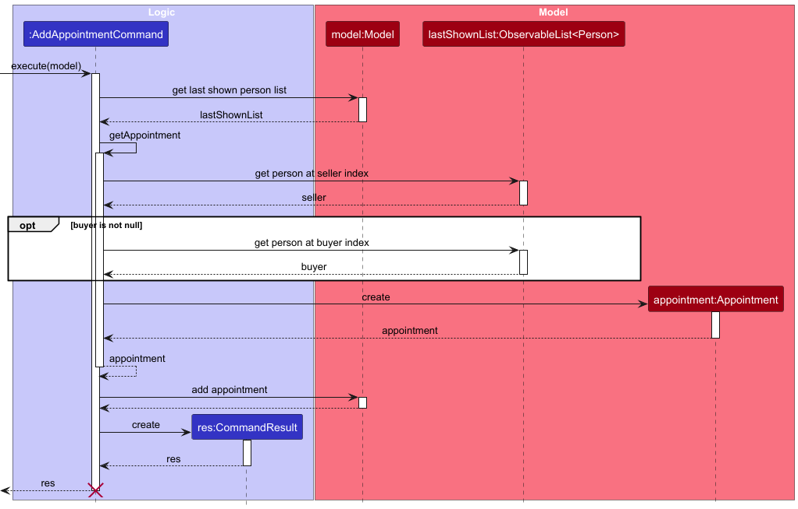

* Table of Contents
{:toc}

--------------------------------------------------------------------------------------------------------------------

## **Acknowledgements**

This project is based on the AddressBook-Level3 (AB3) project that was created by the SE-EDU team. 

--------------------------------------------------------------------------------------------------------------------

## **Setting up, getting started**

Refer to the guide [_Setting up and getting started_](SettingUp.md).

--------------------------------------------------------------------------------------------------------------------

## **Design**

:bulb: **Tip:** The `.puml` files used to create diagrams are in this document `docs/diagrams` folder. Refer to the [_PlantUML Tutorial_ at se-edu/guides](https://se-education.org/guides/tutorials/plantUml.html) to learn how to create and edit diagrams.

### Architecture

The ***Architecture Diagram*** given above explains the high-level design of the App.

Given below is a quick overview of main components and how they interact with each other.

**Main components of the architecture**

**`Main`** (consisting of classes [`Main`](https://github.com/AY2526S1-CS2103T-F08a-3/tp/blob/master/src/main/java/seedu/address/Main.java) and [`MainApp`](https://github.com/AY2526S1-CS2103T-F08a-3/tp/blob/master/src/main/java/seedu/address/MainApp.java)) is in charge of the app launch and shut down.
* At app launch, it initializes the other components in the correct sequence, and connects them up with each other.
* At shut down, it shuts down the other components and invokes cleanup methods where necessary.

The bulk of the app's work is done by the following four components:

* [**`UI`**](#ui-component): The UI of the App.
* [**`Logic`**](#logic-component): The command executor.
* [**`Model`**](#model-component): Holds the data of the App in memory.
* [**`Storage`**](#storage-component): Reads data from, and writes data to, the hard disk.

[**`Commons`**](#common-classes) represents a collection of classes used by multiple other components.

**How the architecture components interact with each other**

The *Sequence Diagram* below shows how the components interact with each other for the scenario where the user issues the command `delete 1` in order to delete the first person in the displayed list.

Each of the four main components (also shown in the diagram above),

* defines its *API* in an `interface` with the same name as the Component.
* implements its functionality using a concrete `{Component Name}Manager` class (which follows the corresponding API `interface` mentioned in the previous point.

For example, the `Logic` component defines its API in the `Logic.java` interface and implements its functionality using the `LogicManager.java` class which follows the `Logic` interface. Other components interact with a given component through its interface rather than the concrete class (reason: to prevent outside component's being coupled to the implementation of a component), as illustrated in the (partial) class diagram below.

The sections below give more details of each component.

### UI component

The **API** of this component is specified in [`Ui.java`](https://github.com/AY2526S1-CS2103T-F08a-3/tp/blob/master/src/main/java/seedu/address/ui/Ui.java)

The UI consists of a `MainWindow` that is made up of parts e.g.`CommandBox`, `ResultDisplay`, `PersonListPanel`, `StatusBarFooter` etc. All these, including the `MainWindow`, inherit from the abstract `UiPart` class which captures the commonalities between classes that represent parts of the visible GUI.

The `UI` component uses the JavaFX UI framework. The layout of these UI parts are defined in matching `.fxml` files that are in the `src/main/resources/view` folder. For example, the layout of the [`MainWindow`](https://github.com/AY2526S1-CS2103T-F08a-3/tp/blob/master/src/main/java/seedu/address/ui/MainWindow.java) is specified in [`MainWindow.fxml`](https://github.com/AY2526S1-CS2103T-F08a-3/tp/blob/master/src/main/resources/view/MainWindow.fxml)

The `UI` component,

* executes user commands using the `Logic` component.
* listens for changes to `Model` data so that the UI can be updated with the modified data.
* keeps a reference to the `Logic` component, because the `UI` relies on the `Logic` to execute commands.
* depends on some classes in the `Model` component, as it displays `Person` object residing in the `Model`.

### Logic component

**API** : [`Logic.java`](https://github.com/AY2526S1-CS2103T-F08a-3/tp/blob/master/src/main/java/seedu/address/logic/Logic.java)

Here's a (partial) class diagram of the `Logic` component:

The sequence diagram below illustrates the interactions within the `Logic` component, taking `execute("delete 1")` API call as an example.

:information_source: **Note:** The lifeline for `DeleteCommandParser` should end at the destroy marker (X) but due to a limitation of PlantUML, the lifeline continues till the end of diagram.

How the `Logic` component works:

1. When `Logic` is called upon to execute a command, it is passed to an `AddressBookParser` object which in turn creates a parser that matches the command (e.g., `DeleteCommandParser`) and uses it to parse the command.
1. This results in a `Command` object (more precisely, an object of one of its subclasses e.g., `DeleteCommand`) which is executed by the `LogicManager`.
1. The command can communicate with the `Model` when it is executed (e.g. to delete a person). 
   Note that although this is shown as a single step in the diagram above (for simplicity), in the code it can take several interactions (between the command object and the `Model`) to achieve.
1. The result of the command execution is encapsulated as a `CommandResult` object which is returned back from `Logic`.

Here are the other classes in `Logic` (omitted from the class diagram above) that are used for parsing a user command:

How the parsing works:
* When called upon to parse a user command, the `AddressBookParser` class creates an `XYZCommandParser` (`XYZ` is a placeholder for the specific command name e.g., `AddCommandParser`) which uses the other classes shown above to parse the user command and create a `XYZCommand` object (e.g., `AddCommand`) which the `AddressBookParser` returns back as a `Command` object.
* All `XYZCommandParser` classes (e.g., `AddCommandParser`, `DeleteCommandParser`, ...) inherit from the `Parser` interface so that they can be treated similarly where possible e.g, during testing.

### Model component
**API** : [`Model.java`](https://github.com/AY2526S1-CS2103T-F08a-3/tp/blob/master/src/main/java/seedu/address/model/Model.java)

The `Model` component,

* stores the address book data i.e., all `Person` objects (which are contained in a `UniquePersonList` object).
* stores the currently 'selected' `Person` objects (e.g., results of a search query) as a separate _filtered_ list which is exposed to outsiders as an unmodifiable `ObservableList<Person>` that can be 'observed' e.g. the UI can be bound to this list so that the UI automatically updates when the data in the list change.
* stores a `UserPref` object that represents the user’s preferences. This is exposed to the outside as a `ReadOnlyUserPref` objects.
* does not depend on any of the other three components (as the `Model` represents data entities of the domain, they should make sense on their own without depending on other components)

### Storage component

**API** : [`Storage.java`](https://github.com/AY2526S1-CS2103T-F08a-3/tp/blob/master/src/main/java/seedu/address/storage/Storage.java)

The `Storage` component,
* can save both address book data and user preference data in JSON format, and read them back into corresponding objects.
* inherits from both `AddressBookStorage` and `UserPrefStorage`, which means it can be treated as either one (if only the functionality of only one is needed).
* depends on some classes in the `Model` component (because the `Storage` component's job is to save/retrieve objects that belong to the `Model`)

### Common classes

Classes used by multiple components are in the `seedu.address.commons` package.

--------------------------------------------------------------------------------------------------------------------

## **Implementation**

This section describes some noteworthy details on how certain features are implemented.

### Appointments

#### Overall Design Considerations:

In planning our design for appointments, we aimed to 
- minimise coupling between new classes added
- maximise cohesion in new classes added and keeping to the design styles present in the existing `Model`.
- make it easily convertible to Json for the `Storage` component.  

We prioritised these factors over implementing the most efficient solution possible as our NFRs did not outline a need to support a data volume large enough such that it would make a major difference. In the event that these requirements became necessary, a good core design would be more easily extensible.

We finalised on the design present in our product before the MVP release. This can be found in [this part](#model-component) of the Architecture section. Of particular note are:

- A unidirectional coupling from `Appointment` to `Person`. We decided that this would suffice, eliminating the need to maintain data integrity if a bidirectional relationship were required. We accepted this tradeoff of reduced coupling for decreased efficiency (to modify a person’s appointments, you would need to look at all appointments to find matches) in line with our design goals. This could be modified in the future if the necessity arises.
- Two distinct associations between `Person` and `Appointment` rather than a single association with multiplicity 2. This is to delineate the distinct buyer and seller roles in an appointment. We gauged that the extra effort to implement a more generalised approach would not be required within the scope of this project. This approach has been outlined in the Future Extensions appendix.
- `AppointmentDatetime` is a separate class. This keeps the design similar to that of `Person`, where even attribute fields like `Name` are modelled as a separate class.
- `buyer` is optional. This feature was not present in the MVP, but we thought that it would be useful to have (perhaps an initial assessment of a property). It would also be possible to make seller optional, but we thought that that would have more niche utility and so didn’t include it.
- Within the `Appointment` class and relevant `Logic` classes (`Parser`, `Command`), the null values are handled internally, with any external exposure making use of Java's `Optional`. This helps to reduce the possibility of having a `NullPointerException`.
- `Person`'s phone number (`Phone`) is made unique. This allows us to store only the phone number of the persons involved in each appointment, removing the possibility of conflicts and increasing the ease of manual editing (for advanced users).

#### Add Appointment

Add appointment (`ap`) allows users to insert a new `Appointment`, with the following parameters:
- `appointmentDatetime`, which is of class `AppointmentDatetime`.
- `seller`, which is of class `Person`.
- `buyer`, which is of class `Person` and can be `null`.

The user passes these parameters in using the prefixes `d/` (datetime), `s/` (seller) and `b/` (buyer).

The `Parser` class for this command helps to convert the input strings into objects to be manipulated.
- The string passed into `d/` is converted directly into the required `AppointmentDatetime` with the help of the `ParserUtil` class.
- The strings passed into `s/` and `b/` are converted (also with `ParserUtil`'s help) into the `Index` abstraction used to represent the index of the requested person in the last shown list. 

These objects are passed into a new `Command` object. This has an overloaded constructor to handle the cases of `buyer` being `null` or otherwise. 

When the `execute` method is executed, 
- the `lastShownList` of Persons is obtained from `Model`.
- the `lastShownList` is asked for the required persons using the `Index` objects. This returns the `Person` objects needed for `seller` and `buyer`.
- finally, the actual `Appointment` is created using the one or two `Person` objects and one `AppointmentDatetime` object, again utilising an overloaded constructor.

The following simplified sequence diagram outlines the main operations of `AddAppointmentCommand::execute`.

### \[Proposed\] Undo/redo feature

#### Proposed Implementation

The proposed undo/redo mechanism is facilitated by `VersionedAddressBook`. It extends `AddressBook` with an undo/redo history, stored internally as an `addressBookStateList` and `currentStatePointer`. Additionally, it implements the following operations:

* `VersionedAddressBook#commit()` — Saves the current address book state in its history.
* `VersionedAddressBook#undo()` — Restores the previous address book state from its history.
* `VersionedAddressBook#redo()` — Restores a previously undone address book state from its history.

These operations are exposed in the `Model` interface as `Model#commitAddressBook()`, `Model#undoAddressBook()` and `Model#redoAddressBook()` respectively.

Given below is an example usage scenario and how the undo/redo mechanism behaves at each step.

Step 1. The user launches the application for the first time. The `VersionedAddressBook` will be initialized with the initial address book state, and the `currentStatePointer` pointing to that single address book state.

Step 2. The user executes `delete 5` command to delete the 5th client in the address book. The `delete` command calls `Model#commitAddressBook()`, causing the modified state of the address book after the `delete 5` command executes to be saved in the `addressBookStateList`, and the `currentStatePointer` is shifted to the newly inserted address book state.

Step 3. The user executes `add n/David …​` to add a new client. The `add` command also calls `Model#commitAddressBook()`, causing another modified address book state to be saved into the `addressBookStateList`.

:information_source: **Note:** If a command fails its execution, it will not call `Model#commitAddressBook()`, so the address book state will not be saved into the `addressBookStateList`.

Step 4. The user now decides that adding the client was a mistake, and decides to undo that action by executing the `undo` command. The `undo` command will call `Model#undoAddressBook()`, which will shift the `currentStatePointer` once to the left, pointing it to the previous address book state, and restores the address book to that state.

:information_source: **Note:** If the `currentStatePointer` is at index 0, pointing to the initial AddressBook state, then there are no previous AddressBook states to restore. The `undo` command uses `Model#canUndoAddressBook()` to check if this is the case. If so, it will return an error to the user rather
than attempting to perform the undo.

The following sequence diagram shows how an undo operation goes through the `Logic` component:

:information_source: **Note:** The lifeline for `UndoCommand` should end at the destroy marker (X) but due to a limitation of PlantUML, the lifeline reaches the end of diagram.

Similarly, how an undo operation goes through the `Model` component is shown below:

The `redo` command does the opposite — it calls `Model#redoAddressBook()`, which shifts the `currentStatePointer` once to the right, pointing to the previously undone state, and restores the address book to that state.

:information_source: **Note:** If the `currentStatePointer` is at index `addressBookStateList.size() - 1`, pointing to the latest address book state, then there are no undone AddressBook states to restore. The `redo` command uses `Model#canRedoAddressBook()` to check if this is the case. If so, it will return an error to the user rather than attempting to perform the redo.

Step 5. The user then decides to execute the command `list`. Commands that do not modify the address book, such as `list`, will usually not call `Model#commitAddressBook()`, `Model#undoAddressBook()` or `Model#redoAddressBook()`. Thus, the `addressBookStateList` remains unchanged.

Step 6. The user executes `clear`, which calls `Model#commitAddressBook()`. Since the `currentStatePointer` is not pointing at the end of the `addressBookStateList`, all address book states after the `currentStatePointer` will be purged. Reason: It no longer makes sense to redo the `add n/David …​` command. This is the behavior that most modern desktop applications follow.

The following activity diagram summarizes what happens when a user executes a new command:

#### Design considerations:

**Aspect: How undo & redo executes:**

* **Alternative 1 (current choice):** Saves the entire address book.
  * Pros: Easy to implement.
  * Cons: May have performance issues in terms of memory usage.

* **Alternative 2:** Individual command knows how to undo/redo by
  itself.
  * Pros: Will use less memory (e.g. for `delete`, just save the client being deleted).
  * Cons: We must ensure that the implementation of each individual command are correct.

--------------------------------------------------------------------------------------------------------------------

## **Documentation, logging, testing, configuration, dev-ops**

* [Documentation guide](Documentation.md)
* [Testing guide](Testing.md)
* [Logging guide](Logging.md)
* [Configuration guide](Configuration.md)
* [DevOps guide](DevOps.md)

--------------------------------------------------------------------------------------------------------------------

## **Appendix: Requirements**

### Product scope

**Target user profile**:

* freelance property agents
* interacts regularly with many clients looking to buy/sell properties
* prefer desktop apps over other types
* can type fast
* prefers typing to mouse interactions
* is reasonably comfortable using CLI apps

**Value proposition**: provide a fast and convenient way to track buyers, sellers, property listings of clients and viewing schedules.

### User stories

Priorities: High (must have) - `* * *`, Medium (nice to have) - `* *`, Low (unlikely to have) - `*`

| Priority | As a …​                                    | I want to …​                    | So that I can…​                                                         |
|----------|--------------------------------------------|---------------------------------|-------------------------------------------------------------------------|
| `* * *`  | new user                                   | see usage instructions          | refer to instructions when I forget how to use the App                  |
| `* * *`  | user                                       | add a new buyer/seller          | remember client details                                                 |
| `* * *`  | user                                       | tag sellers' property details   | easily note and view an important piece of information                  |
| `* * *`  | user                                       | delete a client                 | remove entries that I no longer need                                    |
| `* * *`  | user                                       | list clients                    | get an overview of clients and properties                               |
| `* * *`  | user                                       | find a client by name           | locate details of a client without having to go through the entire list |
| `* * *`  | user                                       | find a property by name         | locate property and seller details without going through the list       |
| `* * *`  | user                                       | schedule appointments           | manage my time effectively                                              |
| `* * *`  | user                                       | view upcoming appointments      | keep track of client meetings                                           |
| `* *`    | new user                                   | import contacts from my phone   | get set up quickly                                                      |
| `* *`    | user                                       | edit client information         | update details when they change                                         |
| `* *`    | user                                       | edit appointments               | update details when they change                                         |
| `* *`    | user                                       | search appointments             | locate details about specific appointments                              |
| `* *`    | user                                       | filter properties               | find properties to recommend to buyers                                  |
| `*`      | user                                       | track transaction progress      | keep track of deals involving buyers/sellers                            |
| `*`      | user with many clients in the address book | sort clients by name            | locate a client easily                                                  |
| `*`      | user with many clients in the address book | find a client with similar name | find the client I'm looking for amidst many similar names               |
| `*`      | user who is a co-broking agent             | add partner agents              | keep track of others involved in a deal                                 |
| `*`      | user with vision impairments               | use accessibility options       | use the application without eye strain                                  |
| `*`      | user                                       | store property images           | easily show it to potential buyers                                      |
| `*`      | user                                       | gather data about transactions  | adapt my work to strike better deals                                    |

### Use cases

(For all use cases below, the **System** is `ClientSquare` and the **Actor** is the `user`, unless specified otherwise)

**Use case: UC01 - Add a client**

**MSS**

1.  User requests to add a client
2.  ClientSquare adds the client

    Use case ends.

**Extensions**

* 1a. Some required information is missing or invalid.

  * 1a1. ClientSquare shows an error message. 

    Step 1 is repeated until the input is valid.
    Use case resumes from step 2.

**Use case: UC02 - View clients**

**MSS**

1.  User requests to list clients.
2.  ClientSquare shows a list of clients.

    Use case ends.

**Use case: UC03 - Remove a client**

**MSS**

1.  User requests to list clients.
2.  ClientSquare shows a list of clients.
3.  User requests to delete a specific client in the list.
4.  ClientSquare deletes the client.

    Use case ends.

**Extensions**

* 2a. The list is empty.

  Use case ends.

* 3a. The given index is invalid.

    * 3a1. ClientSquare shows an error message.

      Use case resumes at step 2.

**Use case: UC04 - Editing a client**

**MSS**

1.  User requests to edit a client with details.
2.  ClientSquare makes the requested edits.

    Use case ends.

**Extensions**

* 1a. No details to edit are provided.

    * 1a1. ClientSquare shows an error message.

      Step 1 is repeated until the input is valid.
      Use case resumes from step 2.

* 1b. Some details to edit are invalid.

    * 1b1. ClientSquare shows an error message detailing the invalid fields.

      Step 1 is repeated until the input is valid.
      Use case resumes from step 2.

**Use case: UC05 - Searching clients**

**MSS**

1.  User requests to find clients/properties by keyword(s)
2.  ClientSquare shows a list of matching clients/properties

    Use case ends.

**Extensions**

* 1a. Keyword is missing.

  * 1a1. ClientSquare shows an error message. 

    Step 1 is repeated until the input is valid.
    Use case resumes from step 2.

**Use case: UC06 - Add an appointment**

**MSS**

1.  User finds the clients involved (UC05).
2.  User requests to add an appointment.
3.  ClientSquare adds the appointment.

    Use case ends.

**Extensions**

* 2a. Some required information is missing or invalid.

  * 2a1. ClientSquare shows an error message. 

    Step 2 is repeated until the input is valid.
    Use case resumes from step 3.

**Use case: UC07 - View appointments**

**MSS**

1.  User requests to list appointments.
2.  ClientSquare shows a list of appointments.

    Use case ends.

**Use case: UC08 - Remove an appointment**

**MSS**

1.  User requests to list appointments.
2.  ClientSquare shows a list of appointments.
3.  User requests to delete a specific appointment in the list.
4.  ClientSquare deletes the appointment.

    Use case ends.

**Extensions**

* 2a. The list is empty.

  Use case ends.

* 3a. The given index is invalid.

    * 3a1. ClientSquare shows an error message.

      Use case resumes at step 2.

**Use case: UC09 - Edit an appointment**

**MSS**

1.  User requests to list appointments (UC07).
2.  User requests to edit a specific appointment in the list.
3.  ClientSquare edits the appointment.

    Use case ends.

**Extensions**

* 1a. User is unable to find the desired appointment.

    * 1a1. User searches for the desired appointment (UC10).
    
      Use case resumes from step 2.

* 1b. There are no appointments in the list.
  
  Use case ends.

* 2a. The requested edits are invalid.
  
    * 2a1. ClientSquare shows an error message.

      Step 2 is repeated until the input is valid.
      Use case resumes from step 3.

**Use case: UC10 - Search for appointment**

**MSS**

1.  User requests to find appointments by keyword(s) and/or timeframe.
2.  ClientSquare shows a list of matching appointments.

    Use case ends.

**Extensions**

* 1a. Both keyword and timeframe are missing.

    * 1a1. ClientSquare shows an error message.

      Step 1 is repeated until the input is valid.
      Use case resumes from step 2.

* 1b. Invalid timeframe is provided.

    * 1b1. ClientSquare shows an error message.

      Step 1 is repeated until the input is valid.
      Use case resumes from step 2.

**Use case: UC11 - Toggle light/dark mode**

**MSS**

1.  User requests to toggle to the opposite theme.
2.  ClientSquare toggles the theme to the one opposite that currently being used. 

    Use case ends.

**Use case: UC12 - Clear data**

**MSS**

1.  User requests to clear all client and appointment data.
2.  ClientSquare clears all clients and appointments.

    Use case ends.

**Use case: UC13 - Exit application**

**MSS**

1.  User requests to exit ClientSquare
2.  ClientSquare saves data and closes the application.

    Use case ends.

### Non-Functional Requirements

1. Should work on any _mainstream OS_ as long as it has Java `17` or above installed.
2. Should be able to hold up to 1000 clients and 1000 appointments without a noticeable sluggishness in performance for typical usage.
3. Should load within 5 seconds on a standard modern laptop.
4. A user who can type faster than 40 words per minute on average for regular English text (i.e. not code, not system admin commands) should be able to use 90% of the application's functions faster using a keyboard than a mouse.
5. The product is to be used by a single user. 
6. The product should work without requiring an installer.
7. The product should work without any other external / online services. 
8. The product should not exceed 100MB in size.
9. The product should not share data outside the application without the user's knowledge.
10. The product should not crash under normal usage, including adding, deleting, and editing multiple clients and appointments.
11. The product should support common screen resolutions like 1080p without display issues.
12. Common operations should complete within 2 seconds.
13. Data should be saved after any CRUD operation to prevent accidental data loss.

### Glossary

* **Client**: A buyer or seller listed as a contact, or is intended to be listed as a contact
* **Mainstream OS**: Windows, Linux, Unix, MacOS
* **Appointment**: A scheduled meeting between a property agent and client(s) (seller and/or buyer)
* **Tag**: A user-defined label used to categorise clients
* **Property Type**: Classification of property according to Singapore's industry norms (HDB, Executive Flats, Condo, Landed Commercial)
* **JSON**: A lightweight text format for data persistence and consistency
* **CRUD**: Operations that create, read, update, or delete data.
* **MSS (Main Success Scenario)**: Describes the most straightforward interaction for a given use case, assuming nothing goes wrong.

--------------------------------------------------------------------------------------------------------------------

## **Appendix: Instructions for manual testing**

Given below are instructions to test the app manually.

:information_source: **Note:** These instructions only provide a starting point for testers to work on;
testers are expected to do more *exploratory* testing.

### Launch and shutdown

1. Initial launch

   1. Download the jar file and copy into an empty folder

   2. Double-click the jar file  
      Expected: Shows the GUI with a set of sample contacts. The window size may not be optimum.

2. Saving window preferences

   1. Resize the window to an optimum size. Move the window to a different location. Close the window.

   2. Re-launch the app by double-clicking the jar file. 
       Expected: The most recent window size and location is retained.

3. Launching with existing data

   1. Prerequisites: Have previously launched the app and added/modified some data. The `data/ClientSquare.json` file exists with your custom data.

   2. Double-click the jar file. 
      Expected: The application starts with your previously saved data (clients and appointments). No sample data is loaded.

4. Shutting down the application

   1. Test case: Close using the window's close button (X)  
      Expected: The application closes gracefully. All data is saved to `data/ClientSquare.json`. Window preferences are saved.

   2. Test case: Use the `exit` command in the command box  
      Expected: The application closes gracefully. All data is saved to `data/ClientSquare.json`. Window preferences are saved.

   3. Test case: Use `File > Exit` menu option  
      Expected: The application closes gracefully. All data is saved to `data/ClientSquare.json`. Window preferences are saved.

### Adding a client

1. Adding a client while all clients are shown. 

    1. Prerequisites: List all clients using the `list` command. The following test cases will use the sample data. If the sample data has been cleared/modified, simply delete the json file to regenerate it.

    2. Test case: `add n/Rahul Dravid p/99262658 e/rahuldravid@example.com r/buyer a/Block 72 Clementi Road, #12-34 pt/HDB_3`  
       Expected: A new client is added at index 7 of the clients' list.

    3. Test case: `add n/David Li p/89252558 e/rahulsachien@example.com r/buyer a/Block 262 Bukit Batok Road, #33-34 pt/CONDO_5`  
       Expected: A new client is added at index 8 of the clients' list.

    4. Test case: `add n/Sam Lee p/89252558 e/samlee@example.com r/seller a/Block 31 Bukit Merah Road, #01-02 pt/COMMERCIAL_LH`  
       Expected: An error will be shown as it is not possible to add two clients with the same phone number.

    5. Test case: `add n/Sam Lee p/89252558 e/samlee@example.com r/seller a/Block 31 Bukit Merah Road, #01-02 pt/COMMERICAL_LH`  
       Expected: An error will be shown as there is a typo in the property type and therefore it is not follow any one of this defined types.

    6. Test case: `add n/Sam Lee p/89252558 e/samlee@example.com r/sell a/Block 31 Bukit Merah Road, #01-02 pt/COMMERICAL_LH`  
       Expected: An error will be shown as the role must either be a 'buyer' or 'seller'.
       
### Editing a client's address 

1. Editing a client's address while all clients are shown. To verify that a client has been edited, use the `list` command to show all clients.
   1. Prerequisites: List all clients using the `list` command. Have at least 1 client in the list. 
   2. Test case: `edit 1 a/123 New Address pt/HDB_4`  
      Expected: First client in the list now has a new address with the property type HDB_4. Details of the edited client will be shown in the status message. 

   3. Test case: `edit 1 a/123`  
      Expected: First client in the list is not edited. An error message is shown indicating that the address and property type must be edited at the same time.

   4. Test case: `edit 1 pt/HDB_4`  
      Expected: First client in the list is not edited. An error message is shown indicating that the address and property type must be edited at the same time.
   
   5. Test case: `edit 1`  
      Expected: First client in the list is not edited. An error message is shown indicating that at least one field must be provided.
   
   6. Test case: `edit`  
      Expected: No client in the list is edited. An error message is shown indicating that the command format is invalid.
      
### Searching for client
1. Searching for clients by keyword(s)

   1. Prerequisites: Have some clients in the client list. Use the `list` command to view all clients.

   2. Test case: `find Alice`  
      Expected: Matching client(s) containing "Alice" in their name are shown. Result message: "X client(s) listed!" and the UI displays the matching entries.

   3. Test case: `find Alice Bob` (multiple keywords of the same field)  
      Expected: Matching client(s) containing "Alice" OR "Bob" in their name are shown. Result message: "X client(s) listed!" and the UI displays the matching entries.

   4. Test case: `find HDB_3 Alice` (different fields)  
      Expected: Matching client(s) having property type "HDB_3" OR containing "Alice" in their name are shown. Result message: "X client(s) listed!" and the UI displays the matching entries.

   5. Test case: `find NonExistentName`  
      Expected: No clients are shown. Result message: "X client(s) listed!" and the UI displays the matching entries.

   6. Test case: `find` (no keywords)  
      Expected: No search performed. An error message is shown indicating invalid command format and displays the correct usage.

### Deleting a client 

1. Deleting a client who has associated appointments.

   1. Prerequisites: The following test cases will use the sample data. If the sample data has been cleared/modified, simply delete the json file to regenerate it. Use `lap` or `sap Irfan` to observe that Irfan has 2 appointments. Use `list` to refresh the person list.

   1. Test case: `delete 5`  
      Expected: Client at index 5 (Irfan) will be deleted. Appointments with Irfan as a participant will also be deleted. You may verify this with `lap` or `sap Irfan`.

### Adding an appointment

1. Adding an appointment while all clients are shown. To verify that an appointment has been added, use the `lap` command to show all appointments.

   1. Prerequisites: List all clients using the `list` command. Multiple clients should be in the list. The following test cases will use the sample data. If the sample data has been cleared/modified, simply delete the json file to regenerate it.

   2. Test case: `ap d/2025-01-01T00:00 s/4 b/3`  
      Expected: A new appointment is added at datetime 2025-01-01T00:00, with seller being the client at index 4, and buyer the client at index 3. 

   3. Test case: `ap d/2025-01-01T00:00 s/5`  
      Expected: A new appointment is added at datetime 2025-01-01T00:00, with seller being the client at index 5, and no buyer. 

   4. Test case: `ap d/2025-01-01T00:00 b/3`  
      Expected: An error will be shown as it is not possible to add appointments without a seller.

### Searching for an appointment

1. Searching for appointments using keywords and/or timeframes.

   1. Prerequisites: Have some appointments in the appointment list. Use the `lap` command to view all appointments. The following test cases will use the sample data. If the sample data has been cleared/modified, simply delete the `data/ClientSquare.json` file to regenerate it.

   2. Test case: `sap Bernice`  
      Expected: 2 appointment(s) listed!, with 2 appointments showing up in the UI.

   3. Test case: `sap tf/upcoming`  
      Expected: 4 appointment(s) listed!, with 4 appointments showing up in the UI.

   4. Test case: `sap tf/past Bernice`  
      Expected: 1 appointment(s) listed!, with 1 appointment showing up in the UI.

   5. Test case: `sap`  
      Expected: Appointments list is not updated. An error message is shown indicating the invalid command format and shows the correct usage.

   6. Test case: `sap tf/invalid`  
      Expected: Appointments list is not updated. An error message is shown, indicating the valid timeframes.

### Deleting an appointment

1. Deleting an appointment while appointments are being shown.

   1. Prerequisites: Have some appointments in the appointment list. Use the `lap` command to view all appointments. The following test cases will use the sample data. If the sample data has been cleared/modified, simply delete the `data/ClientSquare.json` file to regenerate it.

   2. Test case: `dap 1`  
      Expected: The first appointment in the displayed list is deleted. Details of the deleted appointment are shown in the result message, including the appointment datetime and seller name. The appointment is removed from the appointment list.

   3. Test case: `dap 100` (considering user have less than 100 appointments)   
      Expected: No appointment is deleted. An error message is shown indicating that the appointment index provided is invalid.

   4. Test case: `dap 0`  
      Expected: No appointment is deleted. An error message is shown indicating the invalid command format and shows the correct usage.

   5. Test case: `dap`  
      Expected: No appointment is deleted. An error message is shown indicating the invalid command format and shows the correct usage.

2. Deleting an appointment after filtering

   1. Prerequisites: Filter the appointments list using `sap` command. For example, use `sap tf/upcoming` to show only upcoming appointments.

   2. Test case: `dap 1` after filtering  
      Expected: The first appointment in the **filtered** list is deleted (not necessarily the first appointment in the full list). The deleted appointment's details are shown in the result message.

### Editing an appointment

1. Editing an appointment while appointments are being shown.

   1. Prerequisites: Have some appointments in the appointment list. Use the `lap` command to view all appointments. The following test cases will use the sample data. If the sample data has been cleared/modified, simply delete the `data/ClientSquare.json` file to regenerate it.

   2. Test case: `eap 1 d/2025-12-31T15:00`  
      Expected: The datetime of the first appointment is updated to 2025-12-31 at 3:00 PM. The edited appointment details are shown in the result message.

   3. Test case: `eap 1 d/2025-06-15T10:30 s/4 b/1`  
      Expected: Multiple fields are updated - datetime, seller (index 4), and buyer (index 1). The edited appointment details are shown in the result message.

   4. Test case: `eap 1 ` (no fields provided)  
      Expected: No appointment is edited. An error message is shown: "At least one field to edit must be provided."

2. Editing to create duplicate appointment

   1. Prerequisites: Have at least 2 appointments in the list with different details.

   2. Test case: Edit an appointment to have the exact same datetime, seller, and buyer as another existing appointment  
      Expected: No appointment is edited. An error message is shown: "This appointment already exists in the address book."

### Toggling the UI
1. Switching between Light theme and Dark theme
   1. Test case: `toggle`  
      Expected: The UI will change theme (Light -> Dark or Dark -> Light)
   2. Test case: `toggle 123`  
      Expected: The UI will change theme (`Light -> Dark` or `Dark -> Light`)

### Toggling between lists
1. Switching from the client list to the appointment list
   1. Prerequisites: Be on the client list
      1. Test case: `lap`  
         Expected: The UI window will toggle to the appointment list.
      2. Test case: `list`  
         Expected: The UI window will remain on the client list.
2. Switching from the appointment list to the client list
   1. Prerequisites: Be on the appointment list
      1. Test case: `list`  
           Expected: The UI window will toggle to the client list.
      2. Test case: `lap`  
           Expected: The UI window will remain on the appointment list.

### Clearing data and resetting
1. Clearing all currently saved data
   1. Test case: `clear`  
      Expected: All currently saved clients and appointments will be cleared. The client list and appointment list are both empty. 
2. Adding new client after clearing
   1. Prerequisites: Just cleared all saved data using the `clear` command.
      1. Test case: `add n/Rahul Dravid p/99262658 e/rahuldravid@example.com r/buyer a/Block 72 Clementi Road, #12-34 pt/HDB_3`  
      Expected: App behaves normally and new client is added to the client list.
3. Adding new appointment after clearing
   1. Prerequisites: Added a buyer with index 1 and seller with index 2 to the client list after clearing all saved data using the `clear` command.
      1. Test case: `ap d/2025-01-01T00:00 s/2 b/1`  
         Expected: App behaves normally and new appointment is added to the appointment list.

### Saving data

1. Dealing with missing/corrupted data files

   1. Test case: Missing data file
      1. Navigate to the `data` folder in the same directory as the jar file.
      2. Delete the `ClientSquare.json` file if it exists.
      3. Launch the application by double-clicking the jar file. 
      Expected: The application starts successfully with sample data (6 clients and 6 appointments). A new `ClientSquare.json` file is created in the `data` folder.

   2. Test case: Corrupted data file (invalid JSON format)
      1. Navigate to the `data` folder.
      2. Open `ClientSquare.json` with a text editor.
      3. Delete a random character or add invalid text (e.g., remove a closing brace `}` or add random text like `corrupted data`).
      4. Save the file and launch the application. 
      Expected: The application starts with an empty address book (no clients or appointments). The application log will show a warning about the corrupted data file. The corrupted file remains unchanged at startup, but will be overwritten with an empty address book when you perform any action (e.g., list or add a client).

   3. Test case: Data file with missing required fields
      1. Navigate to the `data` folder.
      2. Open `ClientSquare.json` with a text editor.
      3. Find a client entry and remove a required field (e.g., delete the `"name"` field and its value from a person object).
      4. Save the file and launch the application. 
      Expected: The application starts with an empty address book. The application log will show an error indicating which field is missing (e.g., "Illegal values found in data\ClientSquare.json: Person's Name field is missing!").

1. Saving data automatically

   1. Test case: Data is saved after adding a client
      1. Launch the application with existing data.
      2. Add a new client using the command: `add n/Test Person p/91234567 e/test@example.com r/buyer a/123 Test St pt/hdb_3`
      3. Close the application.
      4. Navigate to the `data` folder and open `ClientSquare.json` with a text editor. 
      Expected: The JSON file contains the newly added client with all their details.

   2. Test case: Data is saved after adding an appointment
      1. Launch the application with existing data.
      2. Add a new appointment using the command: `ap d/2025-12-25T14:00 s/4 b/1` (indexes based on sample data, adjust indexes based on your data).
      3. Close the application.
      4. Navigate to the `data` folder and open `ClientSquare.json` with a text editor. 
      Expected: The JSON file contains the newly added appointment with the correct datetime, seller's phone number, and buyer's phone number.

   3. Test case: Data is saved after deleting an client
      1. Launch the application with existing data.
      2. Delete a client using the command: `delete 1`
      3. Close the application.
      4. Navigate to the `data` folder and open `ClientSquare.json` with a text editor. 
      Expected: The deleted client does not appear in the client list as well as all appointments related to that client.

--------------------------------------------------------------------------------------------------------------------

## **Appendix: Effort**

**Difficulty Level**: Medium. The code base was not trivial, but was relatively easy to understand and extend once we got the hang of it. Most of the thought processes behind the features concerned not how they can be technically implemented, but rather how they should be designed in line with the code quality guidelines and existing architecture of AB3. Our codebase increases the complexity of the class structure by having a new entity type (Appointment) that creates relationships amongst the existing entity type (Person), the commands and fields to support those relationships, as well as additional fields and functionality for user convenience.

**Challenges Faced**: The timeline was a bit challenging at times. The first few weeks coincided with the busy midterms period, increasing the overall workload (albeit the deadlines were more lax then). The fact that weekly deadlines fell on Thursday rather than a more conventional Sunday also increased the strain a bit, as it was more difficult to fit our individual schedules.

**Effort Required**: On average, we spent about 10 hours per week on the project per person, slightly above average for a 4MC course including lecture and tutorials. We opted not to overextend ourselves implement features that would be too complex, instead implementing simple but useful features instead. Our product hence does not have an appearance that deviates too much from AB3, and we were roughly in accordance with the 50% iP effort guidelines.

**Achievements**: We evolved AB3 into an application tailored for the use of a specific audience (property agents), by extending the existing contact management features with new ones that would be specifically useful for our audience, such as the ability to create and track appointments with clients, or the ability to store and search by more industry-specific information such as property type. 

--------------------------------------------------------------------------------------------------------------------

## **Appendix: Planned Enhancements**
Team Size: 5
1. **Support multiple properties per seller**. Currently, each seller only has one associated property (stored in the `Address` field), limiting the app's functionality for agents managing seller portfolios with multiple properties.
   - We plan to enhance the feature to support multiple properties per seller by modifying `Person` to hold a `List` of `Address` in a separate `Properties` field. This would cover the case where the Person's actual home address is not one of the properties they wish to sell (common in multi-property portfolios).
   - The property lists would be managed by separate `prop`, `eprop`, `dprop` commands to prevent the existing Person-related commands from being overloaded with responsibility.
   - Appointments would also hold a specific `Address` rather than taking the seller's address.
1. **Role to be allocated per appointment instead of person**. Currently, a `Role` is assigned to a `Person` based on their general status (looking to buy or sell). This limits the usefulness of the field in filtering or searching users as part of their role in appointments.
   - We plan to enhance this feature by making `Role` an association class between `Appointment` and `Person`. A `RoleType` enum would hold the types of roles available (buyer, seller, or future extensions like lessor/lessee). The `Role` class would then hold fields of `RoleType`, `Appointment` and `Person`, and can be interacted with via `UniqueRoleList`.
   - This would allow for more flexible appointments (more than 1 buyer/seller), especially in combination with enhancement 1, improve searchability (search appointments by role of person etc.), and feature extensibility (more role types). 
1. **Filter appointments by custom time range**. Currently, users can only filter appointments by predefined timeframes (`past`, `today`, `upcoming`) using the `sap` command. This limits flexibility when agents need to view appointments within a specific date or time range.
   - We plan to enhance the search appointment feature to allow users to specify custom time ranges using parameters like `from/` and `to/`.
   - Example usage: `sap from/2025-11-01T00:00 to/2025-11-30T23:59` to list all appointments in November 2025.
   - This will provide agents with more precise control over viewing appointments for specific periods, such as weekly schedules, monthly reviews, or custom date ranges for reports. 
1. **Detailed feedback messages**. Currently, the feedback string contained within `CommandResult` cannot be further modified once created. This limits the ability of the application to give detailed feedback that comes from multiple sources (e.g. multiple appointment deletions on client deletion), warnings on successful but potentially undesirable inputs (e.g. appointments being created in the past), or more detailed feedback regarding the specifics of errors (e.g. which field caused a duplicate entry).
   - We plan to extend `CommandResult` with new supporting classes such as `ModelResult` so that each operation done in the model can output specific success/warning/error messages that can together construct the final `CommandResult`. This would allow the users to receive better feedback from the application such that it is easier to use.
1. **More comprehensive search logic**. Currently, the `find` and `sap` commands use OR logic for all keywords regardless of whether they belong to the same field or different fields. For example, `find Alice HDB_3` searches for clients with name containing "Alice" OR property type "HDB_3", which may return too many results including clients that only match one criterion.
   - We plan to enhance the search functionality to use AND logic when keywords are from different fields, while maintaining OR logic for keywords within the same field.
   - For example, `find Alice Bob HDB_3` would search for clients with (name containing "Alice" OR "Bob") AND (property type "HDB_3"), providing more precise results.
   - Similarly, `sap tf/upcoming Bernice Charlotte` would search for appointments with (name containing "Bernice" OR "Charlotte") AND (timeframe is "upcoming").
   - This will allow agents to perform more targeted searches by combining multiple criteria, making it easier to find specific clients or appointments that meet all specified requirements.
1. **Display person list alongside appointment list in split view**. Currently, users can only view either the appointment list (via `lap`) or the person list (via `list`) at any given time. This creates a troublesome workflow when using the `eap` command, which requires knowing indices from both lists simultaneously. Users must repeatedly switch between views to gather the required appointment index, seller index, and buyer index.
   - We plan to enhance the UI layout to display both the person list and appointment list simultaneously in a split-screen view.
   - The main window would be divided vertically, with the person list on the left side and the appointment list on the right side, each occupying approximately 50% of the window width.
   - Both lists would remain independently scrollable and retain their current card-based display format.
   - Commands like `list`, `find`, and `lap` would continue to work as before, updating their respective list panels.
   - Example: When a user executes `lap`, the appointment list updates on the right while the person list remains visible on the left, allowing users to see both "1. Alex Yeoh..." in the person list and "1. 2025-01-15 10:00..." in the appointment list simultaneously when preparing an `eap 1 s/1 b/2` command.
   - This enhancement eliminates the need to switch between views, significantly improving usability for appointment management commands while maintaining all existing functionality.
