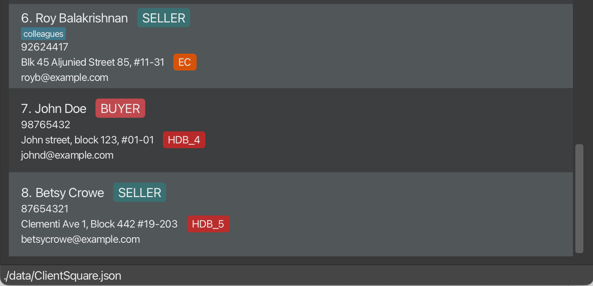
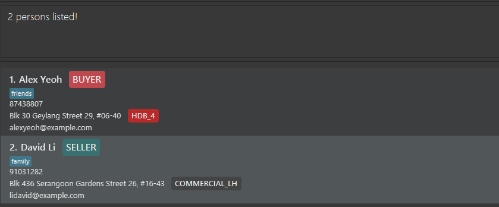
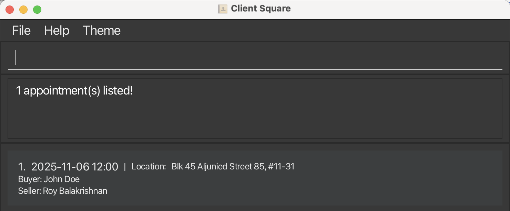
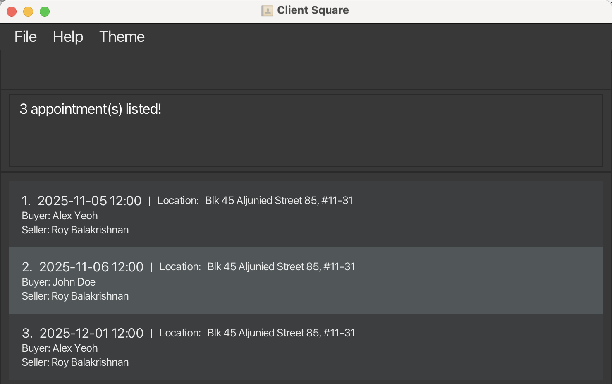
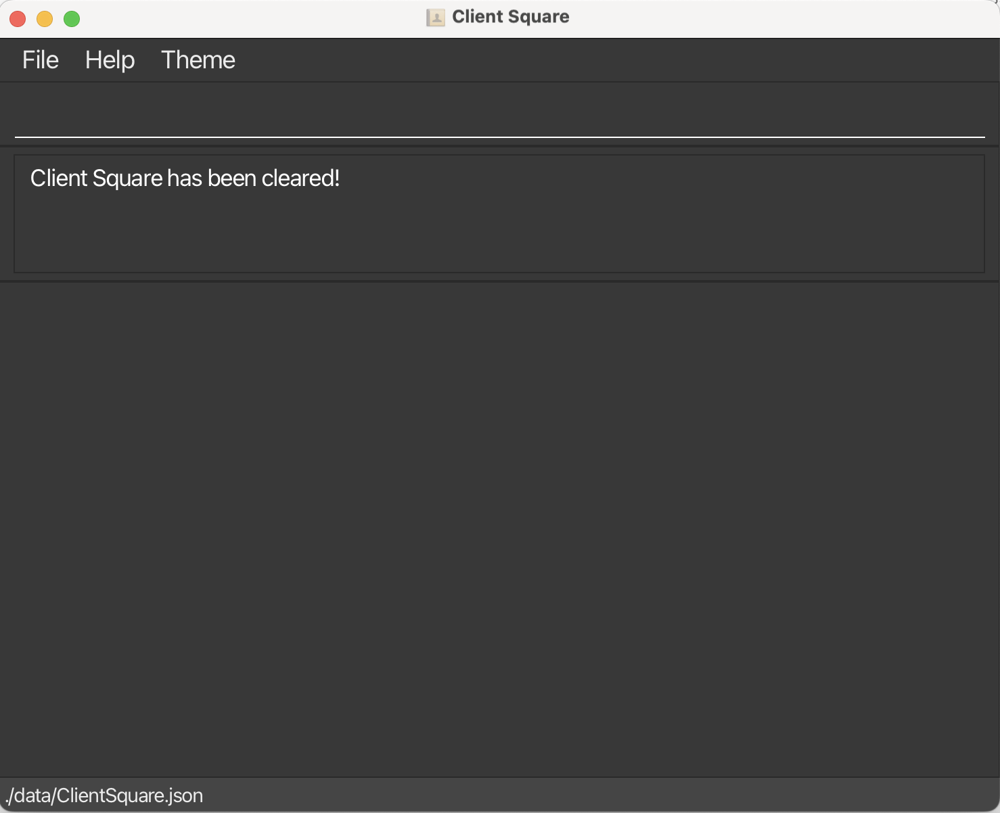
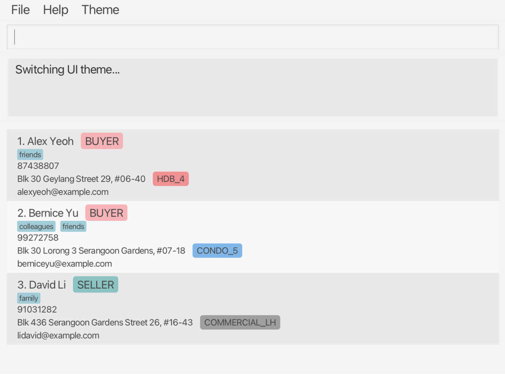
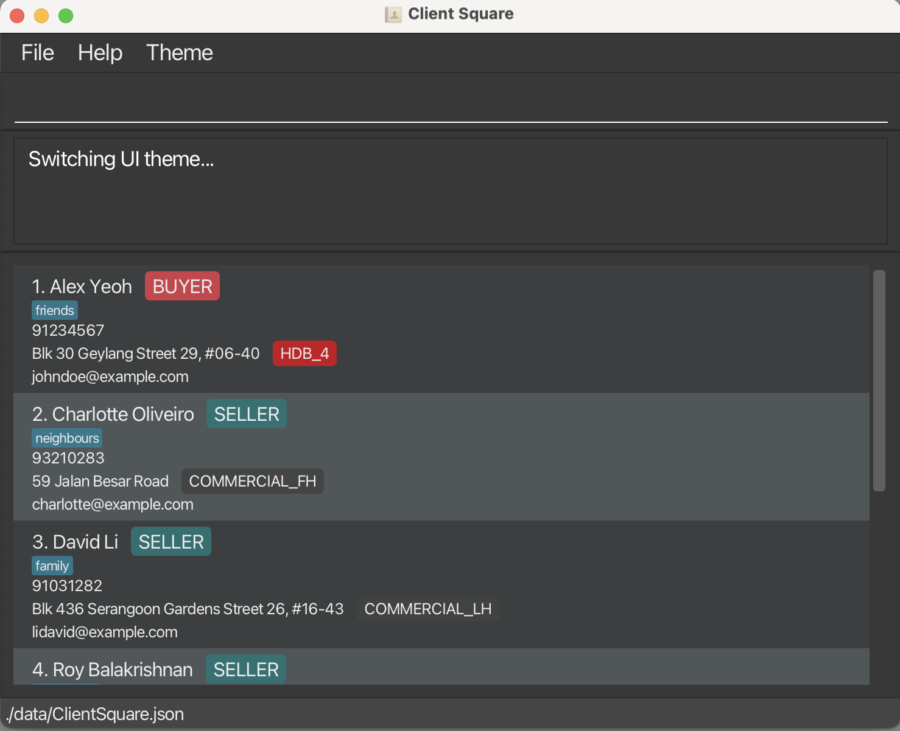

ClientSquare is a **desktop app built for freelance property agents**. It helps you **track buyers and sellers, manage and organize appointments with your clients** - all in one place!

By **typing commands** instead of clicking through menus, you can complete your tasks faster, allowing you to **manage more clients in less time.**

* Table of Contents
{:toc}

--------------------------------------------------------------------------------------------------------------------

## Quick start

Set up ClientSquare and start managing your clients within minutes!

1. **Install Java 17 or later**

   ClientSquare runs on Java, so make sure your computer has **Java 17 or newer** installed. To check if Java is installed, open a command terminal. You may follow the respective instructions for your operating system to do so.
   
   **Windows:**

   1. Press Windows + R to open the Run window. 
   2. Type cmd and press Enter.

   **macOS:**
   1. Open Spotlight Search by pressing Command + Space. 
   2. Type Terminal and press Enter.

   **Linux:**
   1. Press Ctrl + Alt + T to open the Terminal.
   
   Now, run `java -version`. If you see a version number lower than 17, download and install the latest version.  

   **Mac users:** Follow the step-by-step guide [here](https://se-education.org/guides/tutorials/javaInstallationMac.html) to install the correct JDK version.

2. **Download ClientSquare**  
   Go to the [releases page](https://github.com/AY2526S1-CS2103T-F08a-3/tp/releases) and download the latest `.jar` file. This file contains everything you need to run the app.

3. **Choose where to keep the app**  
   Move the downloaded file into any folder where you want ClientSquare to save your data.  
   This folder will serve as your **ClientSquare home directory.**

4. **Open and run the app**  
   Open your command terminal and go to the folder where you saved the file using the `cd` command.  
   Then, **start ClientSquare** by typing: `java -jar ClientSquare.jar`. Alternatively, you may double-click the jar file to launch the application.  
   Within a few seconds, the app window will appear with sample client data for you to explore.  

 
 

**Try a few basic commands**  
   Type a command in the command box and press **Enter** to see it in action.  
   Here are a few examples:

   * `list` : Lists all contacts.

   * `add n/Jane Smith p/92345768 e/janesmith@example.com r/buyer a/239, Hougang Ave 2, #01-13 pt/HDB_3 t/friends t/Neighbour` : Adds a contact named `Jane Smith` to the Address Book.

   * `delete 3` : Deletes the 3rd contact shown in the current list.

   * `clear` : Deletes all contacts.

   * `exit` : Exits the app.

**Explore more features**  
   Once you’re comfortable with the basics, check out the [Features](#features) section below to learn more about what ClientSquare can do!

--------------------------------------------------------------------------------------------------------------------

## Features

**:information_source: Notes about the command format:** 

* Words in `UPPER_CASE` are the parameters to be supplied by the user. 
  e.g. in `add n/NAME`, `NAME` is a parameter which can be used as `add n/John Doe`.

* Items in square brackets are optional. 
  e.g `n/NAME [t/TAG]` can be used as `n/John Doe t/friend` or as `n/John Doe`.

* Items with `…`​ after them can be used multiple times including zero times. 
  e.g. `[t/TAG]…​` can be used as ` ` (i.e. 0 times), `t/friend`, `t/friend t/family` etc.

* Parameters can be in any order. 
  e.g. if the command specifies `n/NAME p/PHONE_NUMBER`, `p/PHONE_NUMBER n/NAME` is also acceptable.

* Extraneous parameters for commands that do not take in parameters (such as `help`, `list`, `exit`, `clear` and `toggle`) will be ignored. 
  e.g. if the command specifies `help 123`, it will be interpreted as `help`.

* If you are using a PDF version of this document, be careful when copying and pasting commands that span multiple lines as space characters surrounding line-breaks may be omitted when copied over to the application.

### Viewing help : `help`

Shows a message explaining how to access the help page.

Format: `help`

  

### Adding a person: `add`

Adds a client to the ClientSquare app. 

Format: `add n/NAME p/PHONE_NUMBER e/EMAIL r/ROLE a/ADDRESS pt/PROPERTY_TYPE [t/TAG]…​`

**:information_source: Valid inputs for Roles and Property Type:** 

**Valid roles** are `buyer` and `seller`.  
**Valid property types** are
`HDB_2`, `HDB_3`, `HDB_4`, `HDB_5`, `HDB_J`,
 
`CONDO_2`, `CONDO_3`, `CONDO_4`, `CONDO_5`, `CONDO_J`,
 
`EXECUTIVE`, `LANDED_LH`, `LANDED_FH`, `COMMERCIAL_LH` and `COMMERCIAL_FH`.

:bulb: **Tip:**
A person can have any number of tags (including none)

Examples:
* `add n/John Doe p/98765432 e/johnd@example.com r/buyer a/John street, block 123, #01-01 pt/HDB_4`
* `add n/Betsy Crowe p/87654321 e/betsycrowe@example.com r/seller a/Clementi Ave 1, Block 442 #19-203 pt/HDB_5`

  

### Listing all persons : `list`

Shows a list of all clients in the ClientSquare app.

Format: `list`

Example:
* `list`

  

### Listing all appointments : `lap`

Shows a list of all appointments in the ClientSquare app, sorted by date and time 
(earliest at the top to latest at the bottom).

Format: `lap`

* Displays all appointments from all clients
* Each appointment shows the date/time, location (seller client's address), and the buyer/seller names
* Appointments are sorted chronologically from present to future
* Use `list` to switch back to the person list view

Example:
* `lap` displays all appointments sorted by date and time

  

### Editing a person : `edit`

Edits an existing person in the ClientSquare app.

Format: `edit INDEX [n/NAME] [p/PHONE] [e/EMAIL] [r/ROLE] [a/ADDRESS] [pt/TYPE] [t/TAG]…​`

* Edits the person at the specified `INDEX`. The index refers to the index number shown in the displayed person list. The index **must be a positive integer** 1, 2, 3, …​
* At least one of the optional fields must be provided.
* Existing values will be updated to the input values.
* You can remove all the person’s tags by typing `t/` without
    specifying any tags after it.

:exclamation: **Caution:**
* Adding of tags is not cumulative. When editing tags, the existing tags of the person will be removed
* Address and property type cannot be edited independently. When editing address or property type, you must provide both address and property type input 
  values.

:information_source: **Note:** 
When changing a person's `ROLE`, previous appointments where the person had their previous role will not be changed. This is to support realistic use cases where a former seller has become a buyer and vice-versa, while retaining their previous appointments without issue. 

**:information_source: Valid inputs for Roles and Property Type:** 

**Valid roles** are `buyer` and `seller`.  
**Valid property types** are
`HDB_2`, `HDB_3`, `HDB_4`, `HDB_5`, `HDB_J`,
 
`CONDO_2`, `CONDO_3`, `CONDO_4`, `CONDO_5`, `CONDO_J`,
 
`EXECUTIVE`, `LANDED_LH`, `LANDED_FH`, `COMMERCIAL_LH` and `COMMERCIAL_FH`.

Examples:
*  `edit 1 p/91234567 e/johndoe@example.com` Edits the phone number and email address of the 1st person to be `91234567` and `johndoe@example.com` respectively.
*  `edit 2 n/Betsy Crower t/` Edits the name of the 2nd person to be `Betsy Crower` and clears all existing tags.
*  `edit 3 r/seller` Edits the role of the 3rd person to `seller`
*  `edit 3 a/59 Jalan Besar Road pt/COMMERCIAL_FH` Edits the address and property type of the 3rd person to `59 Jalan Besar Road` and `COMMERCIAL_FH` respectively.

  
  

### Locating persons by name: `find`

Finds clients whose details contain any of the keywords you provide. Details include (i) name, (ii) role, (iii) email, (iv) address, (v) address type, or (vi) phone number.

Format: `find KEYWORD [MORE_KEYWORDS]...`

* The search is case-insensitive. e.g `hans` will match `Hans`
* The order of the keywords does not matter. e.g. `Hans Bo` will match `Bo Hans`
* Only full words will be matched e.g. `Han` will not match `Hans`
* Persons matching at least one keyword will be returned
  e.g. `Hans Bo` will return `Hans Gruber`, `Bo Yang`

:bulb: **Tip:**
After using the `find` command, you can use the new index numbers shown on screen for commands that require index as an input, such as [`edit`](#editing-a-person--edit) or [`ap`](#adding-an-appointment--ap).

Examples:
* `find Alex` returns all persons named 'Alex' (and anyone with 'Alex' in other details)

  

 
* `find Alex David` returns all persons named 'Alex' **or** 'David' (and anyone with 'Alex' or 'David' in other details)

  

 
* `find buyer` returns all buyers (and anyone with 'buyer' in other details)

  

### Deleting a person : `delete`

Deletes the specified person from the address book.

Format: `delete INDEX`

* Deletes the person at the specified `INDEX`.
* The index refers to the index number shown in the displayed person list. This will be a positive whole number, such as 1, 2, 3, ...
* Deleting a person will also delete all their associated appointments.

:exclamation: **Caution:**
* The `INDEX` is the index number shown in the current or most recently displayed person list. This may be different from the index number in the full person list. If you wish to use the index from the full person list, don't forget to use `list` before using `delete`.
* Deleting a person will also delete all their associated appointments.

:bulb: **Tip:**
Use the [`find`](#locating-persons-by-name-find) command to easily locate the contact that you wish to delete.

Examples:
* `list` followed by `delete 2` deletes the 2nd person in the address book. 

  
  

 

* `find irfan` followed by `delete 1` deletes the 1st person in the results of the `find` command.

  
  

### Adding an appointment : `ap`

Adds an appointment with a seller and an optional buyer. 

Format: `ap d/DATETIME s/SELLER_INDEX [b/BUYER_INDEX]`

* Adds an appointment with the seller being the person specified by `SELLER_INDEX` and the buyer being the person specified by `BUYER_INDEX`. 
* To create an appointment with only a seller, simply omit the `b/` tag. 
* The indices refer to the index numbers shown in the displayed person list which will be a positive whole number (e.g. 1, 2, 3, ...)
* Provide a client that has the role `seller` and an optional client that has the role `buyer`.
* Provide the datetime in an ISO 8601-compliant format. (e.g. `yyyy-MM-ddTHH:mm`)
* The seller's location is automatically displayed as the appointment location. 

:information_source: **Note:** 
It is possible to add multiple appointments at the same time. Appointments will only be regarded as duplicate if they have the same datetime, seller, and buyer (or lack of buyer).

:bulb: **Tip:**
Use the [`find`](#locating-persons-by-name-find) command with multiple keywords (such as `find Alex David`) to easily index the contacts you wish to create an appointment for.

Examples:
*  `ap d/2025-12-01T12:00 s/4 b/1` adds an appointment with seller (index 4: Roy) and buyer (index 1: Alex) on 1 Dec 2025 at 12pm. `lap` can be used to view appointments after adding.

  
  

 

### Deleting an appointment : `dap`

Deletes an appointment.

Format: `dap INDEX`

* Deletes the appointment specified by `INDEX`.
* The index refers to the index number shown in the displayed appointment list. This will be a positive whole number, such as 1, 2, 3, ...

Examples:
*  `dap 1` Deletes the first appointment shown in the appointment list.

### Searching an appointment: `sap`

Finds appointments whose details contain any of the keywords you provide. Details include (i) Buyer Name, (ii) Seller Name, (iii) Appointment Time.

Format `sap KEYWORD [MORE_KEYWORDS]`

* The search is case-insensitive. e.g `hans` will match `Hans`
* The order of the keywords does not matter. e.g. `Hans Bo` will match `Bo Hans`
* Only full words will be matched e.g. `Han` will not match `Hans`
* Persons matching at least one keyword will be returned
  e.g. `Hans Bo` will return `Hans Gruber`, `Bo Yang`

Examples:
* `sap John` returns all appointments with 'John'

  

 

* `sap Alex John` returns all appointments with `Alex` or `John`

  

### Editing an appointment : `eap`

Edits an existing appointment in the displayed appointment list.

Format: `eap APPOINTMENT_INDEX [d/DATETIME] [s/SELLER_INDEX] [b/BUYER_INDEX]`

* Edits the appointment at the specified `APPOINTMENT_INDEX`.
* The appointment index refers to the index number shown in the displayed appointment list (shown after using [`lap`](#listing-all-appointments-lap) or `sap`).
* The seller and buyer indices refer to the index numbers shown in the displayed person list.
* At least one of the optional fields must be provided.
* All indices must be positive whole numbers, such as 1, 2, 3, ...
* Provide the datetime in an ISO 8601-compliant format. (e.g. `yyyy-MM-ddTHH:mm`)
* Existing values will be updated to the input values.
* When editing seller or buyer, the new person must have the appropriate role (seller role for seller, buyer role for buyer).
* The seller and buyer cannot be the same person.

Examples:
* `lap` followed by `eap 1 d/2025-01-15T14:00` changes the datetime of the 1st appointment to 15 Jan 2025 at 2pm.
* `lap` followed by `eap 2 s/3` changes the seller of the 2nd appointment to the 3rd person in the person list.
* `lap` followed by `eap 1 d/2025-02-01T10:00 b/4` changes both the datetime and buyer of the 1st appointment.

Tips:
* Use [`lap`](#listing-all-appointments-lap) first to see the appointment indices.

### Clearing all entries : `clear`

Clears all entries from the address book, including both contacts and appointments.

Format: `clear`

:exclamation: **Caution:**
This action is irreversible. Please be certain before executing this command.

Example:
* `clear`

  

### Toggling UI theme : `toggle`

Switches between **light** and **dark** themes instantly.

Format: `toggle`

* No parameters are required
* Each execution switches to the alternate theme
* Theme preference is **persisted across sessions**

:exclamation: **Caution:**
The theme change applies **immediately** and affects the **entire application interface**

:bulb: **Tip:**
* Switch to **dark mode** when working in low-light environments to reduce eye strain
* Use **light mode** during presentations or when sharing your screen for better visibility
* The theme switches **immediately** without requiring a restart

Examples:
* `toggle` switches from light to dark mode (or vice versa)

  
  

### Exiting the program : `exit`

Exits the program and closes the application window.

Format: `exit`

* The application will close **immediately** without confirmation
* All data is **automatically saved** before exit
* You can also close the application using the window close button (X)

Examples:
* `exit` closes the application

### Saving the data

ClientSquare data are saved in the hard disk automatically after any command that changes the data. There is no need to save manually.

### Editing the data file

ClientSquare data are saved automatically as a JSON file `[JAR file location]/data/ClientSquare.json`. Advanced users are welcome to update data directly by editing that data file.

:exclamation: **Caution:**
If your changes to the data file makes its format invalid, ClientSquare will discard all data and start with an empty data file at the next run. Hence, it is recommended to take a backup of the file before editing it.
 

Furthermore, certain edits can cause the ClientSquare to behave in unexpected ways (e.g., if a value entered is outside of the acceptable range). Therefore, edit the data file only if you are confident that you can update it correctly.

--------------------------------------------------------------------------------------------------------------------

## FAQ

**Q**: How do I transfer my data to another Computer? 
**A**: Install the app in the other computer and overwrite the empty data file it creates with the file that contains the data of your previous ClientSquare home folder.  
**Q**: How do I backup my data? 
**A**: Simply copy the `data/ClientSquare.json` file from your data folder to a safe location. This file contains all your client and appointment information.  
**Q**: Can I have multiple appointments with the same client? 
**A**: Yes, you can schedule multiple appointments with the same buyer or seller. Each appointment is tracked separately by date and time.

--------------------------------------------------------------------------------------------------------------------

## Known issues

1. **When using multiple screens**, if you move the application to a secondary screen, and later switch to using only the primary screen, the GUI will open off-screen. The remedy is to delete the `preferences.json` file created by the application before running the application again.
2. **If you minimize the Help Window** and then run the `help` command (or use the `Help` menu, or the keyboard shortcut `F1`) again, the original Help Window will remain minimized, and no new Help Window will appear. The remedy is to manually restore the minimized Help Window.

--------------------------------------------------------------------------------------------------------------------

## Command summary

Action | Format                                                                                            | Examples | Description
--------|---------------------------------------------------------------------------------------------------| ----------------------- | -------------------
**Add** | `add n/NAME p/PHONE_NUMBER e/EMAIL r/ROLE a/ADDRESS pt/PROPERTY_TYPE [t/TAG]…​`                   | `add n/James Ho p/22224444 e/jamesho@example.com r/buyer a/123, Clementi Rd, 1234665 pt/HDB_3 t/VIP` | Adds a client's contact details into ClientSquare
**List** | `list`                                                                                            | - | List all the clients you have
**Find** | `find KEYWORD [MORE_KEYWORDS]`                                                                    | `find Jake HDB_3` | Find all clients named 'Jake' OR has property type 'HDB_3'
**Edit** | `edit INDEX [n/NAME] [p/PHONE_NUMBER] [e/EMAIL] [r/ROLE] [a/ADDRESS] [pt/PROPERTY_TYPE] [t/TAG]…​` | `edit 2 n/James Lee e/jameslee@example.com`   `edit 4 a/59 Jalan Besar Road pt/COMMERCIAL_FH` | Change the name and email of the second index client.   Change the address and property type of the fourth index client.
**Delete** | `delete INDEX`                                                                                    | `delete 3` | Delete the third indexed client
**Clear** | `clear`                                                                                           | - | Clears all current clients and appointments from the app
**Add Appointment** | `ap d/DATETIME s/SELLER_INDEX [b/BUYER_INDEX]`                                                                | `ap 1 d/2025-01-01:12:00 b/3` | Adds a appointment between seller(indexed 1) and buyer(indexed 3) at that specific timing
**List Appointments** | `lap`                                                                                             | - | List all appointments you have made in chronological order
**Search Appointments** | `sap KEYWORD [MORE_KEYWORDS]`                                                                     | `sap Jake` | Searches all appointments with 'Jake'
**Edit Appointment** | `eap APPOINTMENT_INDEX [d/DATETIME] [s/SELLER_INDEX] [b/BUYER_INDEX]`                             | `eap 1 d/2025-01-15T14:00`   `eap 2 s/3 b/4` | Changes the datetime of appointment 1 to 15 Jan 2025 at 2pm.   Changes the seller and buyer of appointment 2 to person indices 3 and 4.
**Delete Appointment** | `dap INDEX`                                                                             | `dap 1` | Deletes appointment at index 1 at that specific timing
**Help** | `help`                                                                                            | - | A popup with the link to the user guide will show up
